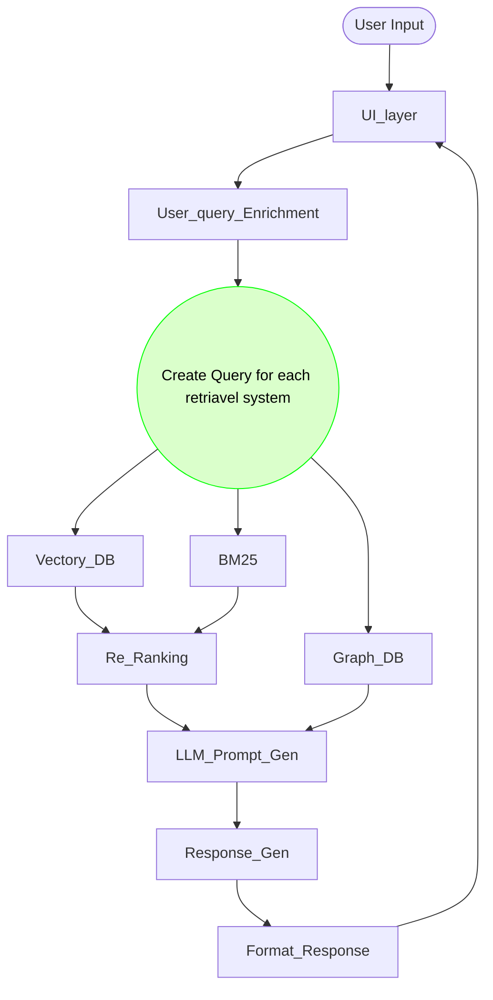
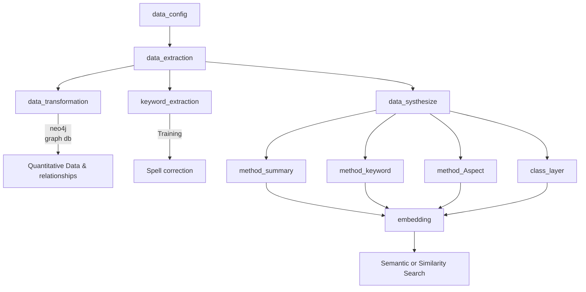

## Sample application code 
1) https://github.com/dotnet/eShop/tree/main - eshoping
2) https://github.com/smartstore/Smartstore/tree/main - smart store.

## Data Preprocessing

- [ ] Extract the data points from source code.
- [ ] Dump each method source code into file
- [ ] Upload the data into graph db.
- [ ] Loop through each method and prepare dataset.

## RAG - Architecture Design

[Advanced Rag - Vipra Singh](https://medium.com/@vipra_singh/building-llm-applications-advanced-rag-part-10-ec0fe735aeb1)
 

## RAG - user query optimization
1) Extract metadata and keywords
2) Fix spelling mistakes particularly on domai specific words
3) Query Expansion
4) Query Decomposition
5) Query Rewrite
6) Query Rephrase with contextual information
7) Check Query for Multihop
8) Hypothetical Document Embeddings (HyDE)
9) Router Query Engine

### keywords
- user input, pre retrieval optimization, user query, query. prompt
- 
### Reference materials
- https://haystack.deepset.ai/cookbook/metadata_enrichment
- https://haystack.deepset.ai/blog/query-decomposition
- https://medium.com/@kbdhunga/advanced-rag-decomposition-technique-in-langchain-c0959541cfec
- https://akash-mathur.medium.com/advanced-rag-query-augmentation-for-next-level-search-using-llamaindex-d362fed7ecc3

# TODO: Identify the list of dataset to be genertaed

## Key points:
- Save all the notes and documents on cloud.

## Available Options for QA:
###  Some popular architectures for closed-domain QA with structured data include:
- Table-based QA: Using table structures to store and query data.
- Graph-based QA: Representing data as graphs for more complex relationships.

### For extractive QA, techniques like:
- Text ranking: Ranking relevant text passages.
- Span selection: Identifying answer spans within passages.

### For generative QA, techniques like:
- Sequence-to-sequence: Generating answers from context.

### QA task complexity:
How complex are your QA tasks?
* Simple: Factoid questions (e.g., "What is the capital of France?").
* Medium: Inference-based questions (e.g., "What are the consequences of climate change?").
* Complex: Multi-hop reasoning, abstract thinking.

### Output format:
Do you need:
* Short answers (e.g., 1-2 sentences).
* Long answers (e.g., paragraphs).

### Framework preference:
Are you familiar with or prefer:
* Hugging Face Transformers.
* TensorFlow/PyTorch.
* Other.

### Preparing Labeled QA Data:
To create annotations, we'll follow these steps:
- Data Extraction: Extract relevant information from your graph database.
- Question Generation: Create questions based on the extracted data.
- Answer Generation: Provide answers to the generated questions.

### C# Concept Focus:
  Given your requirements, the model should understand:
- Code Purpose: Comprehend the functionality and intent behind the code.
- Impact Analysis: Analyze potential consequences of code changes or upgrades.
- API Endpoints: Identify methods serving as endpoints.
- Call Chains: Trace the calling hierarchy for specific methods.

To achieve this, we'll focus on:
- Code Understanding: Model should grasp C# syntax, semantics, and best practices.
- Contextual Reasoning: Model should reason about code context, dependencies, and potential impacts.

### Model Adjustments:
To accommodate these requirements, we might:
Use Code-specific Tokenizers: Ensure accurate tokenization of C# code.
Add Domain-specific Vocabulary: Incorporate C#-related terminology.
Fine-tune on Code-related Tasks: Supplement fine-tuning with code comprehension tasks.

----
----
 
 

# C# Concept Focus Categories
=====================================

### 1. Code Structure and Organization
--------------------------------------

#### Sample Questions

1. What is the purpose of the `MyNamespace` namespace?
2. Which classes inherit from the `BaseClass`?
3. What are the dependencies of the `MyProject` project?
4. How is the solution organized?
5. What is the naming convention used for classes?
6. Which folders contain the business logic?
7. How are interfaces implemented?
8. What is the structure of the data access layer?
9. How are services injected?
10. What is the role of the `Startup` class?

### 2. Class and Method Information
--------------------------------------

#### Sample Questions

1. What does the `MyMethod` method do?
2. What are the parameters and return types of `MyMethod`?
3. Which methods override `MyMethod`?
4. What is the purpose of the `MyClass` class?
5. How does `MyClass` implement the `IMyInterface` interface?
6. What are the properties of `MyClass`?
7. How does `MyMethod` handle exceptions?
8. What is the complexity of `MyMethod`?
9. How is `MyClass` instantiated?
10. What are the thread-safety considerations for `MyMethod`?

### 3. Variable and Data Management
--------------------------------------

#### Sample Questions

1. What is the data type of the `myVariable` variable?
2. Where is `myVariable` used?
3. How is the `myDataStructure` initialized?
4. What is the scope of `myVariable`?
5. How is data persisted?
6. What is the purpose of the `MyEnum` enumeration?
7. How are constants used?
8. What is the difference between `myVariable` and `myProperty`?
9. How is data validated?
10. What are the implications of using `nullable` types?

### 4. Control Flow and Logic
--------------------------------------

#### Sample Questions

1. What conditions must be met for the code block to execute?
2. How does the `myLoop` loop iterate?
3. What are the possible outcomes of the `myConditional` statement?
4. How does `myMethod` handle null values?
5. What is the purpose of the `switch` statement?
6. How are exceptions propagated?
7. What is the difference between `break` and `continue`?
8. How does `myMethod` handle concurrent access?
9. What are the implications of using `async/await`?
10. How is recursion used?

### 5. Error Handling and Debugging
--------------------------------------

#### Sample Questions

1. How does the code handle exceptions?
2. What logging mechanisms are used?
3. What debugging tools are integrated?
4. How are errors propagated?
5. What is the purpose of the `try-catch` block?
6. How are stack traces used?
7. What are the implications of ignoring exceptions?
8. How does the code handle null reference exceptions?
9. What are the best practices for error handling?
10. How is logging configured?

### 6. API and Endpoint Management
--------------------------------------

#### Sample Questions

1. Which methods serve as API endpoints?
2. What HTTP methods are supported?
3. How is authentication handled?
4. What is the purpose of the `ApiController` class?
5. How are API routes configured?
6. What are the implications of using `HTTPS`?
7. How are API requests validated?
8. What are the best practices for API design?
9. How is rate limiting implemented?
10. What are the security considerations for API endpoints?

### 7. Dependency and Library Management
--------------------------------------

#### Sample Questions

1. Which libraries are used?
2. What versions of dependencies are required?
3. How are dependencies injected?
4. What is the purpose of the `NuGet` package manager?
5. How are dependencies updated?
6. What are the implications of using `dependency injection`?
7. How are libraries configured?
8. What are the best practices for dependency management?
9. How are conflicts between dependencies resolved?
10. What are the security considerations for dependencies?

### 8. Security and Access Control
--------------------------------------

#### Sample Questions

1. What security protocols are implemented?
2. How is access control managed?
3. What encryption methods are used?
4. What are the implications of using `HTTPS`?
5. How are passwords stored?
6. What are the best practices for authentication?
7. How are roles and permissions managed?
8. What are the security considerations for data storage?
9. How are vulnerabilities identified?
10. What are the incident response procedures?

### 9. Performance Optimization
--------------------------------------

#### Sample Questions

1. What caching mechanisms are used?
2. How is memory management handled?
3. What optimization techniques are applied?
4. How are database queries optimized?
5. What are the implications of using `async/await`?
6. How is parallel processing used?
7. What are the best practices for performance optimization?
8. How are bottlenecks identified?
9. What are the trade-offs between performance and security?
10. How is performance monitoring implemented?

# RAG Layers

1) UI - To interact with user - start with CUI and later GUI
2) User Input/Query Enrichment - Enrich the user input for better answering.
3) Query Routing and Ensembling - Identify how best the query can be answered, does context dataset is related to qualitative or quantiative or both. 
4) Retrieval - Retrieve the dataset from appropirate database.
5) Ranking - Rank the output excluding the graphdb resultset.
6) Response Generation - consolidate the context data, build prompt and generate response to the user query.
7) Output Formating[optional] - format the generated response if it has to be. In future this could be multimodal response with images generated on the fly based on the response.
8) Feedback, Logging and Monitoring [Partial]: Ability to log the entire process for further tuning. Ability to obtain the feedback from user. 
9) Security and Guard Rails [optional]: Being responsible in all aspect, limiting its conversation within the given context. No bias on response.
10) Personalization [Out of scope]: persist the user role and preferences for response  generation and context details. 

# Workflow
## Inference flow

## Development
